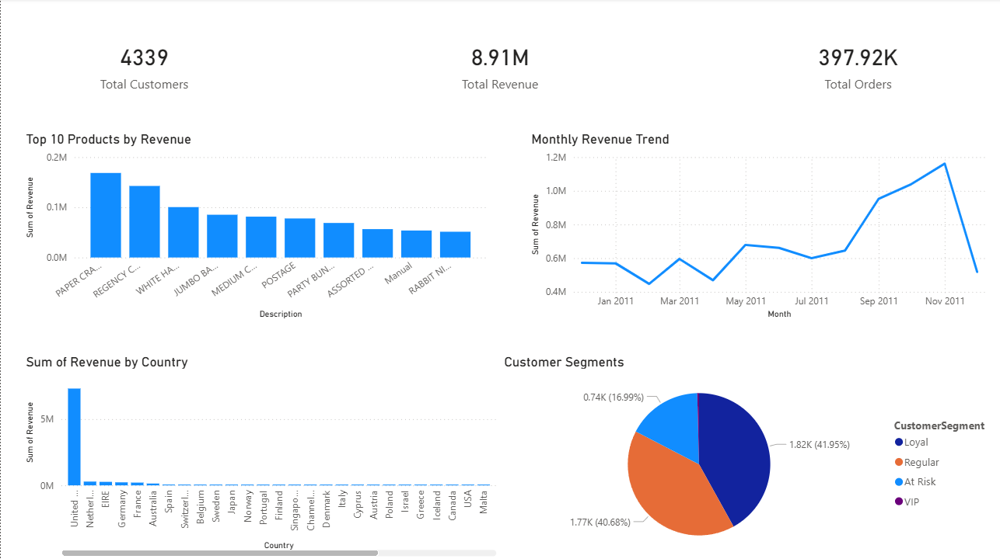

# 🛒 E-Commerce Sales & Customer Analytics

## 📌 Project Overview

This project performs an **end-to-end analysis of an e-commerce retail dataset** to understand sales performance, customer purchasing behavior, and product trends.

The objective is to simulate how a **data analyst working in an e-commerce company** would analyze transactional data to generate **actionable business insights**.

The project covers the full analytics workflow:

• Data cleaning and preprocessing
• Exploratory data analysis using Python
• Customer segmentation using **RFM analysis**
• Business intelligence dashboard using **Power BI**

---

# 🎯 Business Problem

An e-commerce company wants to answer several key questions:

* Which **products generate the highest revenue?**
* How does **revenue change over time?**
* Which **countries contribute the most sales?**
* Who are the **most valuable customers?**
* Which customers are **at risk of leaving?**

Answering these questions allows businesses to:

* Improve **marketing campaigns**
* Optimize **product strategies**
* Increase **customer retention**
* Identify **high-value customer segments**

---

# 📊 Dashboard Preview



The Power BI dashboard summarizes the most important business insights from the dataset.

---

# 📂 Dataset

The dataset used is the **Online Retail Dataset**, which contains real transactional data from a UK-based e-commerce store.

### Dataset Characteristics

* **541,909 transactions**
* **8 key attributes**
* Data recorded between **2010 – 2011**

### Key Features

| Column      | Description                |
| ----------- | -------------------------- |
| InvoiceNo   | Unique order identifier    |
| StockCode   | Product identifier         |
| Description | Product name               |
| Quantity    | Number of items purchased  |
| InvoiceDate | Date of purchase           |
| UnitPrice   | Price per item             |
| CustomerID  | Unique customer identifier |
| Country     | Customer location          |

---

# 🧹 Data Cleaning & Preparation

Before analysis, several preprocessing steps were performed:

• Removed rows with **missing customer IDs**
• Removed **cancelled transactions**
• Created a **Revenue column**
• Extracted **monthly sales trends**

Example feature engineering:

```python
df['Revenue'] = df['Quantity'] * df['UnitPrice']
df['Month'] = df['InvoiceDate'].dt.to_period('M')
```

### Dataset after cleaning

| Stage            | Rows    |
| ---------------- | ------- |
| Original dataset | 541,909 |
| After cleaning   | 397,924 |

---

# 📈 Analysis Performed

## 1️⃣ Monthly Revenue Trend

Analyzed how revenue changes across months.

**Insight:**
Revenue increases significantly between **September and November**, indicating strong seasonal demand during the holiday period.

---

## 2️⃣ Top Products by Revenue

Identified the **top 10 products contributing the most revenue**.

This insight helps businesses:

* Focus marketing on high-performing products
* Improve inventory planning
* Optimize product promotion

---

## 3️⃣ Revenue by Country

Examined which geographic markets contribute most to revenue.

**Insight:**
The **United Kingdom accounts for the majority of sales**, while other European countries contribute smaller portions of revenue.

---

## 4️⃣ Customer Segmentation (RFM Analysis)

Customers were segmented using **RFM metrics**:

| Metric    | Meaning                    |
| --------- | -------------------------- |
| Recency   | Days since last purchase   |
| Frequency | Number of purchases        |
| Monetary  | Total spending by customer |

Customers were grouped into segments:

• **VIP Customers** – highest spending customers
• **Loyal Customers** – frequent buyers
• **Regular Customers** – average purchasing activity
• **At Risk Customers** – customers who haven't purchased recently

This segmentation helps companies run **targeted marketing campaigns**.

---

# 📊 Power BI Dashboard Features

The dashboard provides an interactive overview of business performance:

### Key Performance Indicators

* Total Revenue
* Total Customers
* Total Orders

### Visualizations

* Monthly Revenue Trend
* Top 10 Products by Revenue
* Revenue by Country
* Customer Segmentation (RFM)

---

# 🛠 Tools & Technologies

| Tool         | Purpose               |
| ------------ | --------------------- |
| Python       | Data analysis         |
| Pandas       | Data manipulation     |
| NumPy        | Numerical computation |
| Matplotlib   | Data visualization    |
| Power BI     | Interactive dashboard |
| Git & GitHub | Version control       |

---

# 📁 Project Structure

```
Ecommerce-Analytics-Project
│
├── data
│   ├── online_retail.xlsx
│   ├── cleaned_retail_data.csv
│   └── customer_rfm.csv
│
├── notebooks
│   └── analysis.py
│
├── images
│   └── dashboard.png
│
├── ecommerce_sales_dashboard.pbix
│
└── README.md
```

---

# 💡 Key Business Insights

From the analysis:

• Revenue peaks during **holiday shopping months**
• A small group of products generates **a large share of revenue**
• The **UK market dominates total sales**
• **VIP and loyal customers contribute a significant portion of revenue**
• Identifying **at-risk customers** enables targeted retention strategies

---

# 🚀 Future Improvements

Potential enhancements to this project include:

* Building **sales forecasting models**
* Predicting **customer churn**
* Performing **customer lifetime value analysis**
* Creating a **fully interactive BI report**

---

# 👨‍💻 Author

**Vivek Thapa**

Aspiring **Data Analyst** passionate about turning raw data into meaningful business insights.

---

⭐ If you found this project interesting, consider **starring the repository**.