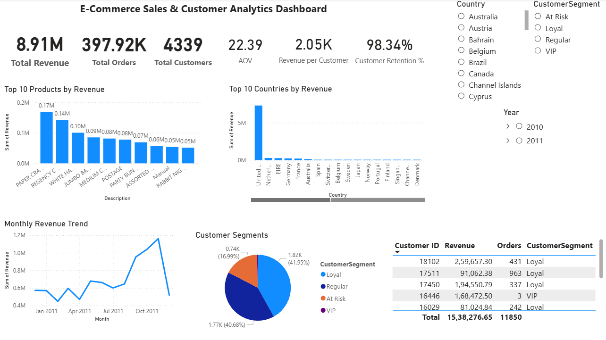

# 🛒 E-Commerce Sales & Customer Analytics (Python + SQL + Power BI)

---

## 📌 Project Overview

This project performs an **end-to-end data analytics workflow** on an e-commerce dataset to extract meaningful business insights and support decision-making.

It simulates how a **data analyst in a real company** would:

* Clean and transform raw transactional data
* Perform exploratory data analysis (EDA)
* Build customer segments using **RFM analysis**
* Create an **interactive Power BI dashboard**
* Use **SQL for structured data querying**

---

## 🎯 Business Objective

The goal is to answer critical business questions:

* Which **products drive the most revenue?**
* How does **sales trend over time?**
* Which **countries contribute most revenue?**
* Who are the **top customers?**
* Which customers are **at risk of churn?**

---

## 📊 Dashboard Preview



---

## 📂 Dataset

* **Online Retail Dataset (UCI / UK-based store)**
* **~541,000+ transactions**
* Time period: **2010–2011**

### Key Columns

| Column      | Description         |
| ----------- | ------------------- |
| InvoiceNo   | Order ID            |
| StockCode   | Product ID          |
| Description | Product name        |
| Quantity    | Units purchased     |
| InvoiceDate | Transaction date    |
| UnitPrice   | Price per unit      |
| CustomerID  | Customer identifier |
| Country     | Customer location   |

---

## 🧹 Data Cleaning & Feature Engineering

Performed using **Python (Pandas)**:

* Removed missing Customer IDs
* Filtered cancelled transactions
* Created **Revenue column**
* Extracted **Month & Year features**

```python
df['Revenue'] = df['Quantity'] * df['UnitPrice']
df['Month'] = df['InvoiceDate'].dt.to_period('M')
```

---

## 🧠 SQL Analysis (NEW 💣)

Used SQL to perform structured querying and aggregation:

* Revenue calculation using `GROUP BY`
* Customer-level aggregation
* Top products and countries extraction

Example:

```sql
SELECT Description, SUM(Quantity * UnitPrice) AS Revenue
FROM retail_data
GROUP BY Description
ORDER BY Revenue DESC
LIMIT 10;
```

👉 Demonstrates ability to work with **relational databases + analytics queries**

---

## 📈 Analysis Performed

### 1️⃣ Monthly Revenue Trend

* Identified **seasonal spikes**
* Peak sales observed during **holiday months (Sep–Nov)**

---

### 2️⃣ Top Products Analysis

* Top 10 products contribute **significant portion of revenue**
* Helps in **inventory and marketing optimization**

---

### 3️⃣ Country-wise Revenue

* **UK dominates revenue**
* Other countries contribute smaller shares

---

### 4️⃣ Customer Segmentation (RFM)

Customers segmented into:

* **VIP** → High value
* **Loyal** → Frequent buyers
* **Regular** → Average
* **At Risk** → Potential churn

👉 Enables **targeted marketing strategies**

---

## 📊 Power BI Dashboard Features

### 🔑 KPIs

* Total Revenue
* Total Orders
* Total Customers
* AOV (Average Order Value)
* Revenue per Customer
* Customer Retention %

---

### 📊 Visualizations

* Monthly Revenue Trend
* Top 10 Products
* Top 10 Countries
* Customer Segmentation (Pie Chart)
* Top Customers Table

---

### ⚡ Interactivity

* Dynamic **slicers (Year, Country, Segment)**
* Interactive filtering across visuals

---

## 🛠 Tech Stack

| Tool         | Purpose                     |
| ------------ | --------------------------- |
| Python       | Data cleaning & EDA         |
| Pandas       | Data manipulation           |
| SQL          | Data querying & aggregation |
| Power BI     | Dashboard creation          |
| Git & GitHub | Version control             |

---

## 📁 Project Structure

```
Ecommerce-Analytics-Project/
│
├── data/
│   ├── cleaned_retail_data.csv
│
├── sql/
│   └── analysis.sql
│
├── powerbi/
│   └── ecommerce_dashboard.pbix
│
├── images/
│   └── dashboard.png
│
├── notebooks/
│   └── analysis.py
│
└── README.md
```

---

## 💡 Key Insights

* Revenue peaks during **holiday season**
* A few products generate **majority of revenue**
* **UK is dominant market**
* **VIP & Loyal customers drive business**
* Identifying **At Risk customers** enables retention strategies

---

## 🚀 Resume Highlights

* Built an **end-to-end analytics pipeline (Python → SQL → Power BI)**
* Developed **interactive dashboard with business KPIs**
* Implemented **RFM-based customer segmentation**
* Performed **data cleaning, feature engineering, and aggregation**

---

## � Business Recommendations

* Prioritize the top revenue-generating products in promotions and inventory planning to maximize return on marketing spend.
* Launch targeted retention campaigns for the “At Risk” customer segment to recover high-value customers before they churn.
* Expand focus on high-potential international markets outside the UK by localizing offers and optimizing pricing.
* Use AOV and RFM segment insights to personalize offers for VIP, Loyal, and Regular customers.
* Track these recommendations monthly with the dashboard KPIs and refine them through A/B testing.

---

## �👨‍💻 Author

**Vivek Thapa**
Aspiring Data Analyst

---

⭐ If you found this project useful, consider starring the repo!